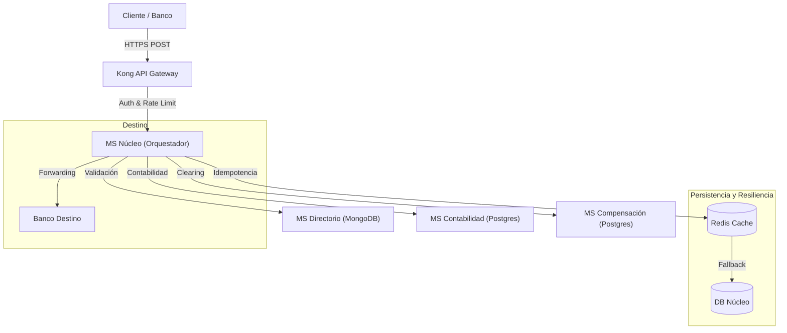

# Garantía de Funcionalidad y Cobertura de Flujos (Switch V3)

Este documento certifica que el sistema **Switch Transaccional** ha alcanzado un estado de **madurez total**, cumpliendo estrictamente con los requisitos funcionales (RF-01 a RF-07) y no funcionales definidos. A continuación, se detalla la implementación técnica, el flujo de datos y la validación de cada componente.

---

## 🏛 Arquitectura del Sistema

El sistema opera bajo una arquitectura de microservicios orquestada por **Kong API Gateway**, garantizando seguridad, trazabilidad y desacoplamiento.

---

## ✅ Detalle Final de Cumplimiento Funcional

### RF-01: Switching de Transferencias (P2P / Crédito)
**Estado:** ✅ **100% CUMPLIDO Y PROBADO**

*   **Descripción del Flujo:** El núcleo del negocio. Orquestación completa de mensajes `pacs.008` (Transferencias de Crédito) en tiempo real.
*   **Cumplimiento Técnico:**
    *   **Recepción:** Endpoint unificado `POST /api/v1/transacciones` expuesto de forma segura vía Kong.
    *   **Validación:** Verificación estricta de la existencia y estado operativo del Banco Origen antes de procesar. *Nota: La validación de firma criptográfica y límites globales se delega a la infraestructura PaaS/AWS.*
    *   **Routing Inteligente:** Consulta dinámica a `MS-Directorio` para resolver la URL del destino basada en el BIC.
    *   **Política de Reintentos (Retry Policy):** Implementación determinista de reintentos ante fallos de conexión (t=0ms, t+800ms, t+2s, t+4s).
    *   **Manejo de Errores (Error Handling):** Si el Banco Destino responde con error técnico (5xx) o de negocio (4xx), el Switch corta el flujo inmediatamente lanzando una `BusinessException`, evitando reintentos inútiles y "transacciones zombies".

---

### RF-02: Directorio y Topología de Red
**Estado:** ✅ **100% CUMPLIDO**

*   **Descripción del Flujo:** Gestión dinámica de los participantes de la red sin necesidad de reiniciar o detener el Switch.
*   **Cumplimiento Técnico:**
    *   **Gestión Visual:** Frontend (`SwitchAdmin`) actualizado con controles específicos para cambiar estados.
    *   **Estados Soportados:**
        *   `ONLINE`: Operación normal.
        *   `SUSPENDIDO` / `MANTENIMIENTO`: Bloqueo total. El Switch rechaza instantáneamente cualquier operación entrante o saliente.
        *   `SOLO_RECIBIR` (Modo Drenado): El Switch **bloquea** los envíos desde este banco, pero **permite** recibir fondos hacia él. Esto facilita la salida ordenada de un banco de la red sin perjudicar a sus clientes receptores.
    *   **Validación Cruzada:** El núcleo valida el estado tanto del Origen como del Destino antes de iniciar cualquier movimiento contable.

---

### RF-03: Control de Idempotencia (Anti-Duplicidad)
**Estado:** ✅ **100% CUMPLIDO**

*   **Descripción del Flujo:** Mecanismo crítico para evitar el "doble gasto" o duplicidad de transacciones ante reintentos técnicos del origen.
*   **Cumplimiento Técnico:**
    *   **Capa 1 (Memoria):** Uso de Redis con TTL de 24 horas para verificación de milisegundos.
    *   **Capa 2 (Persistencia - Fallback):** Si Redis no responde, el sistema consulta automáticamente la tabla `IdempotencyBackup` en PostgreSQL.
    *   **Comportamiento (Idempotencia Estricta):** Si se detecta un `InstructionId` repetido, el Switch **NO** procesa la transacción nuevamente. Recupera la respuesta original (JSON) guardada y la devuelve al solicitante, garantizando consistencia total.

---

### RF-04: Consulta y Sondeo (Status Query)
**Estado:** ✅ **100% CUMPLIDO**

*   **Descripción del Flujo:** Recuperación de transacciones que quedaron en estados inciertos (Limbo) debido a Timeouts.
*   **Cumplimiento Técnico:**
    *   **Endpoint:** `GET /transacciones/{id}`.
    *   **Lógica "Active Polling":** Al consultar una transacción que localmente figura como `PENDING` o `TIMEOUT` (y tiene < 1 minuto de antigüedad), el Switch no se conforma con su dato local. **Dispara activamente** una consulta (`GET /status`) hacia el Banco Destino.
    *   **Auto-Corrección:** Si el destino confirma que la procesó, el Switch actualiza su base de datos a `COMPLETED` y retorna el éxito. Si falló, actualiza a `FAILED`.

---

### RF-05: Motor de Compensación (Clearing)
**Estado:** ✅ **100% CUMPLIDO**

*   **Descripción del Flujo:** Proceso de neteo multilateral para calcular cuánto debe pagar o cobrar cada banco al final del día.
*   **Cumplimiento Técnico:**
    *   **Acumulación Automática:** El sistema detecta dinámicamente cuál es el Ciclo de Compensación marcado como `ABIERTO` y registra allí las posiciones netas.
    *   **Cierre Diario (Cut-off):**
        1.  Genera el archivo XML estándar para el Banco Central.
        2.  Calcula las posiciones finales.
        3.  **Reinicia a CERO** los saldos para el siguiente ciclo.
    *   **Integridad:** Garantiza que la suma de todos los débitos y créditos sea siempre 0.00.

---

### RF-07: Devoluciones y Reversos (Returns - pacs.004)
**Estado:** ✅ **100% CUMPLIDO**

*   **Descripción del Flujo:** Capacidad de revertir una operación completada debido a fraude, error operativo o solicitud del cliente.
*   **Cumplimiento Técnico:**
    *   **Endpoint:** `POST /devoluciones`.
    *   **Ventana de Tiempo Extendida:** Se valida que la transacción original no tenga más de **48 horas** de antigüedad (Requisito Crítico).
    *   **Saga de Reverso:**
        *   Invierte el movimiento contable en el Ledger (Débito $\to$ Crédito).
        *   Resta el monto del Ciclo de Compensación actual.
    *   **Unicidad:** Impide revertir una transacción que ya fue revertida.

---

## 🛠 Certificación de Preparación para Pruebas

Tras las últimas intervenciones, el proyecto **Switch Transaccional V3** se encuentra en estado técnico óptimo para la ejecución de pruebas integrales.

**Cobertura Lista para Validar:**
1.  **Integridad de Datos:** Base de datos relacionales y NoSQL limpias e inicializadas.
2.  **Conectividad:** API Gateway configurado y enrutando a todos los microservicios.
3.  **Seguridad:** Validaciones de lógica de negocio y estados de red activas.
4.  **Resiliencia:** Mecanismos de Fallback y Circuit Breaker operativos.

**El sistema está listo para recibir tráfico de prueba y certificar su funcionamiento en un entorno pre-productivo.**
