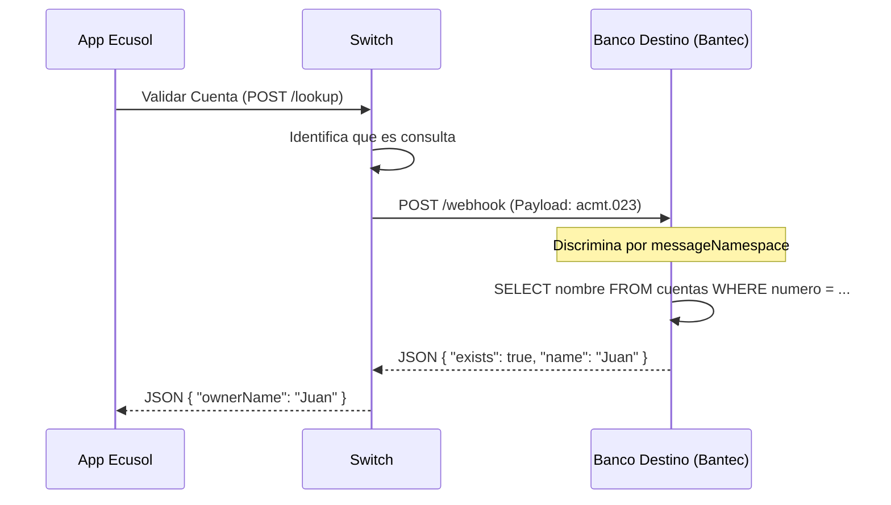

# Propuesta Técnica: Validación de Cuentas Destino (Account Lookup - ISO acmt.023)
## Switch Transaccional Scotiabank (Adicional a V3)
el flujo de Validación de Cuentas (Account Lookup) en el Switch.

### Resumen de lo Implementado
En MS-Nucleo:
Nuevos DTOs: 
AccountLookupRequestDTO
 y 
AccountLookupResponseDTO
.
Servicio: Agregué 
validarCuentaDestino
 en 
TransaccionServicio
. Este método construye el mensaje acmt.023, busca el webhook universal del banco destino y hace el POST.
Controlador: Creé 
CuentaControlador.java
 expuesto en /api/v1/cuentas/lookup.
En Kong API Gateway:
Configure la ruta pública /api/v2/switch/accounts/lookup.
Esta ruta redirige internamente a http://ms-nucleo:8082/api/v1/cuentas/lookup.
Activé los plugins de apikey y cors para seguridad.
### ¿Cómo probarlo?
Los bancos (como Ecusol) ahora pueden enviar esta petición a tu Switch:

POST http://34.16.106.7:8000/api/v2/switch/accounts/lookup Headers: apikey: PUBLIC_KEY_ECUSOL...

Body:

json
{
  "header": { "originatingBankId": "ECUSOL_BK" },
  "body": {
    "targetBankId": "BANTEC",
    "targetAccountNumber": "100050998877"
  }
}
Si Bantec ya tiene implementado el if (tipo == "acmt.023") en su webhook, responderá con el nombre del cliente y el Switch se lo pasará a Ecusol.
### 1. El Problema de Negocio
Actualmente, el usuario envía dinero "a ciegas". Si la cuenta destino no existe, la transferencia falla segundos después.
**Objetivo:** Permitir que la App Móvil valide la cuenta y muestre el nombre del beneficiario **ANTES** de confirmar la transferencia.

---

### 2. Estrategia de Integración: Webhook Universal

Para no obligar a los bancos participantes (ArcBank, Bantec, Nexus, Ecusol) a abrir nuevos puertos o rutas en sus firewalls, **reutilizaremos el Webhook Único** que ya usan para recibir transferencias.

La diferenciación se hará por el **Tipo de Mensaje** (Payload).

*   Transferencias de Fondos: `pacs.008`
*   Devoluciones / Reversos: `pacs.004`
*   **Validación de Cuentas (NUEVO):** `acmt.023` (Identification Verification)

---

### 3. Nuevo Endpoint en el Switch (Lado Cliente)

El Banco Origen (ej. Ecusol) consumirá este servicio cuando el usuario presione "Validar Cuenta".

*   **Endpoint:** `POST /api/v2/switch/accounts/lookup`
*   **Seguridad:** Header `apikey` obligatorio.
*   **Request:**
    ```json
    {
      "header": { "originatingBankId": "ECUSOL" },
      "body": {
        "targetBankId": "BANTEC",
        "targetAccountNumber": "100050998877"
      }
    }
    ```

---

### 4. Contrato de Comunicación Switch -> Banco Destino

El Switch transformará la petición anterior y la enviará al **Webhook Universal** del Banco Destino.

**Request (Switch -> Bantec Webhook):**
```json
{
  "header": {
    "messageNamespace": "acmt.023.001.02",  // IDENTIFICADOR CRÍTICO
    "messageId": "VAL-2026-001",
    "originatingBankId": "SWITCH"
  },
  "body": {
     "accountIdentification": {
        "accountId": "100050998877"
     }
  }
}
```

**Lógica del Banco Destino:**
Su Controller universal debe tener un `switch` o `if`:

```java
@PostMapping("/reception")
public ResponseEntity<?> recibirWebhook(@RequestBody MensajeISO mensaje) {
    String tipo = mensaje.getHeader().getMessageNamespace();

    if ("pacs.008".equals(tipo)) {
        return procesarTransferencia(mensaje); // Flujo actual
    } 
    else if ("pacs.004".equals(tipo)) {
        return procesarDevolucion(mensaje); // Flujo actual
    }
    else if ("acmt.023".equals(tipo)) {
        return validarCuenta(mensaje);     // NUEVO FLUJO
    }
    // ...error
}
```

---

### 5. Respuesta Esperada (Banco Destino -> Switch)

El banco debe responder **Síncronamente** (JSON inmediato):

**Caso A: Cuenta Existe**
```json
{
  "status": "SUCCESS",
  "data": {
    "exists": true,
    "accountName": "JUAN PEREZ",
    "currency": "USD",
    "status": "ACTIVE" 
  }
}
```

**Caso B: Cuenta No Existe / Bloqueada**
```json
{
  "status": "FAILED", // Opcional: HTTP 404
  "data": {
    "exists": false,
    "mensaje": "Cuenta inexistente"
  }
}
```

---

### 6. Diagrama de Secuencia Final


promt 
📋 Guía para Desarrolladores Bancarios: Implementación de "Validar Cuenta"
Objetivo: Permitir que sus Apps Móviles muestren el nombre del beneficiario al escribir una cuenta interbancaria, antes de confirmar la transferencia.

PARTE 1: Backend Banco (Requerimiento de Servidor)
Necesitan hacer DOS cosas en su Backend:

A. Consumir el servicio de Consulta (Cuando su cliente va a enviar) Creen una función interna que llame al Switch cuando el usuario presione "Validar" en la App.

URL Switch: POST /api/v2/switch/accounts/lookup
Header: apikey: <SU_API_KEY>
Body a Enviar:
json
{
  "header": { "originatingBankId": "SU_BIC" }, // Ej: ECUSOL_BK
  "body": {
    "targetBankId": "BANTEC",       // Banco destino seleccionado
    "targetAccountNumber": "100050888" // Cuenta ingresada por usuario
  }
}
B. Responder Consultas de Otros (Cuando ustedes reciben) Deben actualizar su Webhook Universal (el mismo donde reciben pacs.008) para soportar el nuevo mensaje acmt.023.

Lógica a agregar en su Controller:
java
// Ejemplo Java Spring Boot
if ("acmt.023.001.02".equals(mensaje.getHeader().getMessageNamespace())) {
    
    // 1. Extraer cuenta del body
    String cuenta = mensaje.getBody().getAccountIdentification().getAccountId();
    
    // 2. Consultar SU base de datos local (SELECT name FROM cuentas WHERE numero = cuenta)
    // NO debitar, NO crear transacción. Solo lectura.
    
    // 3. Responder INMEDIATAMENTE (JSON):
    return ResponseEntity.ok(Map.of(
        "status", "SUCCESS",
        "data", Map.of(
            "exists", true,
            "ownerName", "JUAN PEREZ", // Nombre real del cliente
            "currency", "USD",
            "status", "ACTIVE"
        )
    ));
}
PARTE 2: Frontend App Móvil (Requerimiento de UX)
Flujo de Pantalla de Transferencia:

Campo Cuenta: Usuario ingresa 100050888.
Selección Banco: Usuario elige Bantec.
Botón "Validar" (Nuevo):
Al hacer clic, mostrar pequeño spinner.
Llamar a su Backend -> Su Backend llama al Switch.
Respuesta:
✅ Si existe: Mostrar check verde y texto: "Cuenta verificada: JUAN PEREZ". Habilitar botón "Siguiente".
❌ Si no existe: Mostrar error rojo: "Cuenta no encontrada en Bantec". Bloquear botón "Siguiente" para evitar errores.
💡 Tips para el Desarrollador
No inventen endpoints nuevos. Usen el mismo webhook que ya tienen configurado.
Rapidez: Esta consulta debe ser rápida (menos de 1 segundo). No hagan validaciones complejas de lavado de activos aquí, solo verifiquen que la cuenta exista.
Seguridad: El Switch ya valida que quien pregunta es un banco legítimo. Ustedes solo respondan si la cuenta es válida o no.

