# 🏦 Switch Transaccional Interbancario (ISO 20022)

Este repositorio actúa como el **Orquestador de Infraestructura** para el sistema de Switch Transaccional Bancario. Contiene la configuración de despliegue (Docker Compose), la gestión del API Gateway (Kong) y los scripts operativos de inicio.

El sistema permite la interoperabilidad en tiempo real entre instituciones financieras, garantizando:
*   **Idempotencia y Trazabilidad.**
*   **Contabilidad Centralizada (Ledger)** con integridad criptográfica.
*   **Compensación (Clearing)** en tiempo real.
*   **Seguridad perimetral** (API Gateway).
*   **Estándar de mensajería ISO 20022.**

---

## 🏗️ Arquitectura del Sistema

El ecosistema se compone de 5 Microservicios (Spring Boot 3.5+) y un API Gateway (Kong).

| Servicio | Puerto Docker | Puerto Gateway (Público) | Descripción |
| :--- | :--- | :--- | :--- |
| **API Gateway (Kong)** | 8000 | 8000 | Punto único de entrada, Seguridad (API Key), Rate Limiting. |
| **MS Núcleo** | 8082 | N/A | Orquestador transaccional, Idempotencia y comunicación Push. |
| **MS Directorio** | 8081 | N/A | Registro de participantes, Reglas de Enrutamiento (BINs) y Circuit Breaker. |
| **MS Contabilidad** | 8083 | N/A | Ledger centralizado (Cuentas Técnicas) con hash de seguridad. |
| **MS Compensación** | 8084 | N/A | Acumulación de débitos/créditos por ciclo operativo. |
| **MS Devoluciones** | 8085 | N/A | Catálogo de errores ISO y gestión de solicitudes de reverso. |

### Flujo de Transacción

```mermaid
graph LR
    BancosExternos -- 1. POST /transferir (ISO 20022) --> Kong[Kong Gateway :8000]
    Kong -- 2. Auth OK --> Nucleo[MS Núcleo]
    Nucleo -- 3. Validar Ruta --> Directorio[MS Directorio]
    Nucleo -- 4. Movimiento Dinero --> Ledger[MS Contabilidad]
    Nucleo -- 5. Registrar Clearing --> Compensacion[MS Compensación]
    Nucleo -- 6. Notificar (Webhook) --> BancoDestino[Banco Destino]
```



---

## 📦 Instalación y Despliegue

### 1. Clonar el Repositorio Maestro

```bash
git clone https://github.com/IanAlvarezCordova/switch-transaccional.git switch-orchestrator
cd switch-orchestrator
```

### 2. Clonar los Microservicios

El código fuente de los servicios reside en sus propios repositorios. Clonarlos dentro de esta carpeta para que Docker los encuentre.

```bash
# Nombres de carpetas OBLIGATORIOS (según docker-compose.yml):
git clone https://github.com/MMoyano10/MSNucleoSwitch.git MSNucleoSwitch
git clone https://github.com/IanAlvarezCordova/ms-directorio.git ms-directorio
git clone https://github.com/BrayanVegaG0/Switch-ms-contabilidad.git Switch-ms-contabilidad
git clone https://github.com/MMoyano10/MSCompensacionSwitch.git MSCompensacionSwitch
git clone https://github.com/MMoyano10/MSDevolucionSwitch.git MSDevolucionSwitch
```

### 3. Levantar el Entorno

Este comando compilará los microservicios Java, configurará las redes y levantará Kong y las bases de datos.

```bash
docker-compose -f docker-compose-full.yml up --build -d
```
Conecta Kong:

Name: Switch Kong

Kong Admin URL: http://kong:8001 (Usa el nombre del contenedor).


---

## 📜 Scripts de Inicialización (Obligatorio)

Al iniciar por primera vez, el sistema está "vacío". Ejecute estos comandos en orden (Git Bash o Postman) para configurar la red bancaria.

### 1. Iniciar Ciclo de Compensación (VITAL)
El núcleo necesita un ciclo abierto (ID 1) para acumular saldos.

```bash
curl -X POST http://localhost:8084/api/v1/compensacion/ciclos -H "Content-Type: application/json" -d '{ "fechaCorte": "2025-12-29", "estado": "ABIERTO", "descripcion": "Ciclo Operativo Diario" }'
```

### 2. Registrar Bancos Participantes (Directorio)
Registramos a los 4 bancos con sus URLs de Webhook.
*(Nota: Ajustar las URLs host.docker.internal:Puertos según donde corran sus simuladores).*

#NEXUS

```json
	{
	  "codigoBic": "NEXUS_BANK",
	  "nombre": "Nexus",
	  "urlDestino": "http://18.225.27.253:9080/api/transacciones/webhook",
	  "llavePublica": "NEXUS_SECRET_KEY_123",
	  "estadoOperativo": "ONLINE"
	}

```

#ECUSOL

```json
	{
	  "codigoBic": "ECUSOL_BK",
	  "nombre": "EcuSol",
	  "urlDestino": "http://3.20.230.110:9180/api/transacciones/webhook",
	  "llavePublica": "PUBLIC_KEY_ECUSOL_67890",
	  "estadoOperativo": "ONLINE"
	}
```

#ARCBANK

```json
	{
	  "codigoBic": "ARCBANK",
	  "nombre": "ARCBANK",
	  "urlDestino": "http://35.208.155.21:4080/api/core/transferencias/recepcion",
	  "llavePublica": "ARCBANK_SECRET_KEY_2025_XYZ",
	  "estadoOperativo": "ONLINE"
	}
```

#BANTEC

```json
	{
	  "codigoBic": "BANTEC",
	  "nombre": "BANTEC",
	  "urlDestino": "http://35.209.79.193:8082/api/core/transferencias/recepcion",
	  "llavePublica": "BANTEC_SECRET_KEY_2025",
	  "estadoOperativo": "ONLINE"
	}
```


### 3. Configurar Reglas de Enrutamiento / BINs (Directorio)
Asociamos los prefijos de cuenta a cada banco.

```bash
curl -X POST http://localhost:8081/api/v1/reglas -H "Content-Type: application/json" -d '{ "prefijoBin": "270100", "institucion": { "codigoBic": "NEXUS_BANK" } }'
curl -X POST http://localhost:8081/api/v1/reglas -H "Content-Type: application/json" -d '{ "prefijoBin": "370100", "institucion": { "codigoBic": "ECUSOL_BK" } }'
curl -X POST http://localhost:8081/api/v1/reglas -H "Content-Type: application/json" -d '{ "prefijoBin": "400000", "institucion": { "codigoBic": "ARCBANK" } }'
curl -X POST http://localhost:8081/api/v1/reglas -H "Content-Type: application/json" -d '{ "prefijoBin": "100000", "institucion": { "codigoBic": "BANTEC" } }'
```

### 4. Crear Cuentas Técnicas y Fondear (Contabilidad)
Abrimos las billeteras y depositamos fondos iniciales ($1,000,000 USD) para operar.

```bash
# A. CREAR CUENTAS (Saldo $0)
curl -X POST http://localhost:8083/api/v1/ledger/cuentas -H "Content-Type: application/json" -d '{ "codigoBic": "NEXUS_BANK" }'
curl -X POST http://localhost:8083/api/v1/ledger/cuentas -H "Content-Type: application/json" -d '{ "codigoBic": "ECUSOL_BK" }'
curl -X POST http://localhost:8083/api/v1/ledger/cuentas -H "Content-Type: application/json" -d '{ "codigoBic": "ARCBANK" }'
curl -X POST http://localhost:8083/api/v1/ledger/cuentas -H "Content-Type: application/json" -d '{ "codigoBic": "BANTEC" }'

# B. FONDEAR (Depositar dinero del Banco Central)
curl -X POST http://localhost:8083/api/v1/ledger/movimientos -H "Content-Type: application/json" -d '{ "codigoBic": "NEXUS_BANK", "idInstruccion": "00000000-0000-0000-0000-000000000001", "monto": 1000000, "tipo": "CREDIT" }'
curl -X POST http://localhost:8083/api/v1/ledger/movimientos -H "Content-Type: application/json" -d '{ "codigoBic": "ECUSOL_BK", "idInstruccion": "00000000-0000-0000-0000-000000000002", "monto": 1000000, "tipo": "CREDIT" }'
curl -X POST http://localhost:8083/api/v1/ledger/movimientos -H "Content-Type: application/json" -d '{ "codigoBic": "ARCBANK", "idInstruccion": "00000000-0000-0000-0000-000000000003", "monto": 1000000, "tipo": "CREDIT" }'
curl -X POST http://localhost:8083/api/v1/ledger/movimientos -H "Content-Type: application/json" -d '{ "codigoBic": "BANTEC", "idInstruccion": "00000000-0000-0000-0000-000000000004", "monto": 1000000, "tipo": "CREDIT" }'
```

### 5. Poblar Catálogo de Errores ISO (Devoluciones)

```bash
curl -X POST http://localhost:8085/api/v1/reference/iso20022/errors -H "Content-Type: application/json" -d '{ "codigo": "AC03", "descripcion": "InvalidCreditorAccountNumber" }'
curl -X POST http://localhost:8085/api/v1/reference/iso20022/errors -H "Content-Type: application/json" -d '{ "codigo": "AM04", "descripcion": "InsufficientFunds" }'
```

---

## 🧪 Pruebas de Integración (End-to-End)

Para realizar una transferencia real a través del Gateway seguro.

*   **Ruta:** `POST https://switch-interbank.ddns.net/api/v1/transacciones`
*   **Headers:** `apikey: NEXUS_SECRET_KEY_123`
*   **Body (ISO 20022):**

```json
{
  "header": {
    "messageId": "MSG-{{$timestamp}}",
    "creationDateTime": "{{$timestamp}}",
    "originatingBankId": "NEXUS_BANK"
  },
  "body": {
    "instructionId": "{{$guid}}", 
    "endToEndId": "REF-CLI-{{$randomInt}}",
    "amount": { "currency": "USD", "value": 50.00 },
    "debtor": { "name": "Juan Perez", "accountId": "2701009999", "accountType": "CHECKING" },
    "creditor": { "name": "Maria Lopez", "accountId": "3701008888", "accountType": "SAVINGS", "targetBankId": "ECUSOL_BK" },
    "remittanceInformation": "Pago Prueba"
  }
}
```

Otra prueba
```json
{
  "header": {
    "messageId": "MSG-NEX-ARC-{{$timestamp}}",
    "creationDateTime": "2025-12-29T15:30:00Z",
    "originatingBankId": "NEXUS_BANK"
  },
  "body": {
    "instructionId": "{{$guid}}",
    "endToEndId": "REF-COMERCIO-{{$randomInt}}",
    "amount": {
      "currency": "USD",
      "value": 75.50
    },
    "debtor": {
      "name": "Juan Perez",
      "accountId": "27010012345",
      "accountType": "CHECKING"
    },
    "creditor": {
      "name": "Consultora Tech S.A.",
      "accountId": "40000098765",
      "accountType": "CHECKING",
      "targetBankId": "ARCBANK"
    },
    "remittanceInformation": "Pago Factura Servicios"
  }
}
```

---

## 📊 Monitoreo

*   
*   
